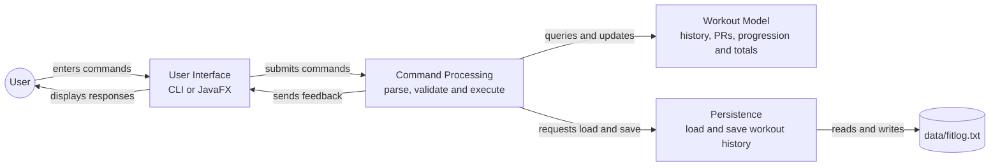
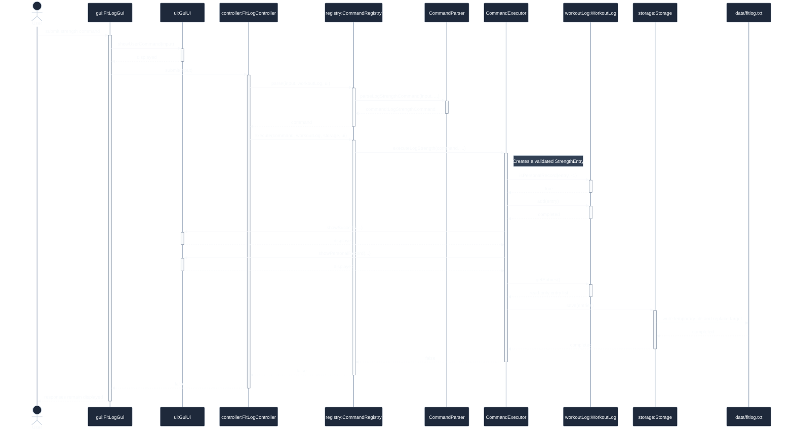

# Developer Guide

## Architecture

FitLog is organised into console and JavaFX entry points over a shared controller
and domain layer:



*Figure 1. FitLog architecture diagram. Arrows show which component initiates
each runtime interaction.*

The User Interface component is implemented by the CLI (`FitLog` and
`ConsoleUi`) or JavaFX interface (`Launcher`, `FitLogGui`, and `GuiUi`). Both
interfaces submit commands to the same Command Processing component, which
contains `FitLogController`, `CommandRegistry`, `CommandParser`, and
`CommandExecutor`. Command processing sends categorised feedback through `Ui`,
queries and modifies the `WorkoutLog` model, and accesses persistence through
the `EntryStorage` abstraction. The production `Storage` implementation reads
and replaces `data/fitlog.txt`. This separation allows either interface to reuse
the same command behaviour and allows tests to substitute non-file storage.

- `FitLog` is the console entry point. It reads console commands and passes them
  to a controller until the user exits or input ends.
- `Launcher` is the plain Java entry point used by Gradle's `run` task. It calls
  `Application.launch(FitLogGui.class, args)` rather than directly launching a
  JavaFX `Application` subclass.
- `FitLogGui` creates the JavaFX scene, wires Enter and Send-button events to the
  controller, and closes the window shortly after a `bye` response.
- `FitLogController` coordinates startup loading and one-command submission. It
  delegates recognition, parsing, execution, and help generation through the
  shared `CommandRegistry`.
- `CommandRegistry` is the single registration point for supported commands.
  Each `CommandDefinition` associates one command type with its input matcher,
  parser, executor, syntax, and example, so parsing, execution, and help cannot
  drift into separate command catalogues.
- `CommandParser` contains command-specific input validation, while
  `CommandExecutor` coordinates command behaviour and persistence. `EntryEditor`
  rebuilds immutable entries, and `EntryFormatter` formats list, find, and stats
  output.
- `Ui` is an output interface with separate information, example, success, error,
  warning, and PR feedback methods. `ConsoleUi` implements it with plain console output,
  owns the `Scanner`, prints the `> ` prompt, and returns `null` at end-of-file.
- `GuiUi` implements `Ui` by rendering categorised messages as styled JavaFX
  conversation bubbles and scrolling to the newest message.
- `WorkoutLog` owns the in-memory `List<ExerciseEntry>`. It provides add, delete,
  replace, lookup, and listing operations, case-insensitive substring search with
  original list positions, normalised exact-name lookup for progression, and
  collection-level PR comparison and volume totals across the complete loaded
  workout history.
- `EntryStorage` abstracts loading and saving entries so the controller and
  command-execution pipeline do not depend on a persistence format. `Storage` is
  the file-backed implementation: it loads valid entries with per-line
  malformed-data warnings and saves a supplied list to disk without printing
  user messages.
- `ExerciseEntry` is the sealed shared abstraction for immutable `StrengthEntry`
  and `CardioEntry` values. These final classes are the only permitted entry
  types, matching FitLog's two exercise categories. The base class stores the
  immutable exercise name and logging time; each subtype supplies display details
  and its PR metric.
- `ExerciseValueValidator` defines the shared name, positive-whole-number, and
  finite-positive-number rules used by entry constructors and command parsing.
  Storage parsing delegates these domain checks to the constructors, preventing
  separate saved-data rules from drifting out of sync.
- `Command` is an extensible interface. The built-in command records are `ByeCommand`,
  `ListCommand`, `DeleteCommand`, `EditCommand`, `LogStrengthCommand`,
  `LogCardioCommand`, `FindCommand`, `StatsCommand`, `VolumeCommand`, and
  `HelpCommand`. They
  represent successfully parsed commands; validation errors are reported during
  parsing before a command record is created.

At runtime, either `FitLog`/`ConsoleUi` or `Launcher`/`FitLogGui` supplies input
to `FitLogController`. The registry resolves the input into a `Command` and
dispatches its registered executor. Command behaviour uses `WorkoutLog` for
collection operations, `EntryStorage` for successful mutations, and `Ui` for
categorised feedback. Production supplies the file-backed `Storage`, while tests
can substitute an in-memory implementation or precise failure test double.

### Command submission and persistence

Figure 2 follows one specific successful scenario: the user submits a valid
strength command in the JavaFX interface, the new entry establishes a personal
record, and persistence succeeds. The CLI joins the same interaction at
`FitLogController.submit(String)`; only the initial input and final rendering
differ.



*Figure 2. Sequence diagram for a successful strength log that creates a PR and
is saved to disk.*

Lifelines written as `object:Class` denote runtime objects. `CommandParser` and
`CommandExecutor` are shown by class name because their registered operations
are static. Solid arrows represent method calls and dashed arrows represent
returns. The `false` return value propagates to `FitLogGui` to indicate that the
interaction should continue; only `bye` returns `true`. The executor updates the
in-memory log and displays success and PR feedback before saving the complete
read-only entry list. If saving instead throws an `IOException`, the in-memory
change remains and the executor reports a warning through `Ui`; that alternative
is described here rather than adding another scenario to this sequence diagram.

### GUI reuse after the controller refactor

The `start()`/`submit(String)` controller design was deliberately introduced
before the GUI. It replaces the former blocking console read loop with one-command
operations that JavaFX event handlers can call directly. This allows the GUI to
reuse the existing parsers, command records, validation messages, persistence, and
command execution without duplicating command logic.

`WorkoutLog`, `Storage`, `ExerciseEntry` and its subclasses, and the command
model required zero changes when the GUI was introduced. Only the UI layer and
entry points differed from the console version.

### JavaFX and Gradle setup

`build.gradle.kts` applies the `org.openjfx.javafxplugin` Gradle plugin at version
`0.1.0`, configures JavaFX `26.0.1`, and enables the `javafx.controls` module.
The application main class is `fitlog.Launcher`. The separate launcher avoids the
classpath issues that can occur when the Java launcher is asked to start a JavaFX
`Application` subclass directly.

## Design decisions

### Immutable entries

`StrengthEntry` and `CardioEntry` fields are final. An `edit` command validates the
new value and reconstructs a replacement entry, which `WorkoutLog.replace` places
at the same index. This avoids partially updated values and preserves each entry's
simple value-object behaviour. Their constructors also enforce the domain
invariants, so entries created outside the command parser cannot contain blank
names, non-positive counts or durations, or non-finite/non-positive measurements.

### PRs are computed on demand

`WorkoutLog.isPersonalRecord` scans the current collection when an entry is logged
or edited. It compares only same-type entries with the same normalised exercise
name, excludes the edited entry itself, and requires a strictly greater metric.
During an edit, the candidate occupies an existing position in the log, so the
controller passes that position as `excludedIndex`; logging passes `-1` because
there is no existing entry to exclude. This prevents an edited entry from being
compared against its previous value. `WorkoutLog` rejects any other exclusion
index with an always-on `IllegalArgumentException`, rather than relying on Java
assertions that may be disabled at runtime.

The result is calculated from the current in-memory log and is not stored on an
entry. Consequently, deleting a former PR cannot leave stale PR state; a later
log or edit always evaluates the then-current history.

### Help output presentation

`HelpCommand` does not mutate the workout log or trigger a storage save. Its
execution emits each command syntax through `Ui.showInfo`, followed by its
example through `Ui.showExample`. Keeping examples as a separate UI feedback
category lets `ConsoleUi` indent them and lets `GuiUi` apply the
`example-message` CSS class, which uses a muted monospace font, without placing
JavaFX styling concerns in `FitLogController`.

### Tab-separated storage

`Storage` writes one entry per line in UTF-8:

```text
strength<TAB>name<TAB>sets<TAB>reps<TAB>weightKg<TAB>loggedAt
cardio<TAB>name<TAB>durationMinutes<TAB>distanceKm<TAB>loggedAt
```

`loggedAt` is an ISO-8601 `LocalDateTime` representing when FitLog received the
log command. For cardio entries without a distance, the distance field is empty.
`formatLoggedAt` serialises known timestamps with `LocalDateTime.toString()` and
writes an empty final field when the time is unknown. `parseLoggedAt` uses
`LocalDateTime.parse`, which reads the same ISO-8601 representation.

Backward compatibility is handled by accepting both the current field counts
(six fields for strength and five for cardio) and the legacy counts without a
timestamp (five and four respectively). Legacy entries receive a `null`
`loggedAt` value and display `time not recorded`; no historical time is invented.

Tabs make the file both human-readable and simple to parse. This is safe under
the current name parser because it rebuilds names from whitespace-split tokens,
so names cannot contain literal tabs. `Storage.save` writes a temporary file and
then replaces the data file atomically when supported, falling back to a normal
replacement when it is not.

### Malformed storage lines

`Storage.load` reads the UTF-8 file one line at a time and passes each line to
`parseEntry`. A line is malformed when it has an unknown entry type, the wrong
number of tab-separated fields, a blank exercise name, an invalid numeric or
timestamp value, or a non-positive/non-finite measurement. The type-specific
parsers return `null` for failed structural or range checks, while
`parseEntry` converts `NumberFormatException` and `DateTimeParseException` into
the same `null` result.

Loading continues after a malformed line. Each `null` result produces a warning
containing the one-based source line number, while valid lines before and after
it remain in the returned `LoadResult`.

## Testing

FitLog uses focused unit tests for command parsing, execution, editing, formatting,
domain operations, and persistence. Controller tests cover the boundaries between
those components, while the console transcript remains a manual end-to-end
regression reference.

### Numeric parser coverage

`CommandParserTest` covers valid numeric values together with zero, negative,
non-numeric, fractional whole-number, `NaN`, and infinite inputs. Constructor and
storage tests independently verify the same domain boundaries. When changing
numeric parsing or validation messages, run `./gradlew test` and the relevant
`pre-refactor-transcript.md` scenarios.

### Automated tests

JUnit tests under `src/test/java/fitlog` cover the implemented non-GUI behaviour:

- `CommandParserTest`, `CommandExecutorTest`, `EntryEditorTest`, and
  `EntryFormatterTest` cover syntax validation, every command path, immutable field
  updates, persistence triggers, PR notifications, and formatted output.
- `WorkoutLogTest` covers collection operations, strength and cardio PR rules,
  search semantics, read-only exposure, normal totals, and overflow boundaries.
- `StorageTest` covers both entry formats, timestamps and legacy data, malformed
  shapes and values, mixed valid/invalid input, replacement, empty saves, round
  trips, and parent-directory creation.
- `ExerciseEntryTest` covers accessors, formatting, timestamps, PR values, and
  constructor invariants.
- `FitLogControllerTest`, `CommandRegistryTest`, and `ConsoleUiTest` cover component
  coordination, storage failures and warnings, extensible registration, EOF, and
  console rendering.

`docs/pre-refactor-transcript.md` is the manual regression baseline for console
behaviour and GUI presentation. JavaFX layout and styling remain manual checks
because they depend on a graphical runtime and visual inspection.

## Software engineering process

FitLog was developed in small, working increments. Features were first scoped
and their edge cases agreed before implementation; larger structural changes
were then extracted in stages while keeping the application runnable. For
example, `Ui`, `WorkoutLog`, and the command hierarchy were introduced one at a
time, with the console regression transcript used to confirm that user-visible
behaviour did not change.

The current verification approach combines focused JUnit tests for domain and
storage behaviour with the console regression transcript and the GUI manual test
plan. Before submitting a change, run `./gradlew test` and replay the relevant
manual scenario when it changes command output or JavaFX interaction.

## Acknowledgements

This project was built with AI assistance from Codex. I reviewed and
guided the resulting design, implementation, tests, and documentation.

The project structure and command-oriented interaction style draw on the
CS2103/T individual-project conventions referenced in the assignment brief.
The graphical interface uses [OpenJFX](https://openjfx.io/) and its Gradle
plugin. The build uses [Gradle](https://gradle.org/), automated tests use
[JUnit 5](https://junit.org/junit5/), and the optional distributable JAR task
uses the [GradleUp Shadow plugin](https://gradleup.com/shadow/).
